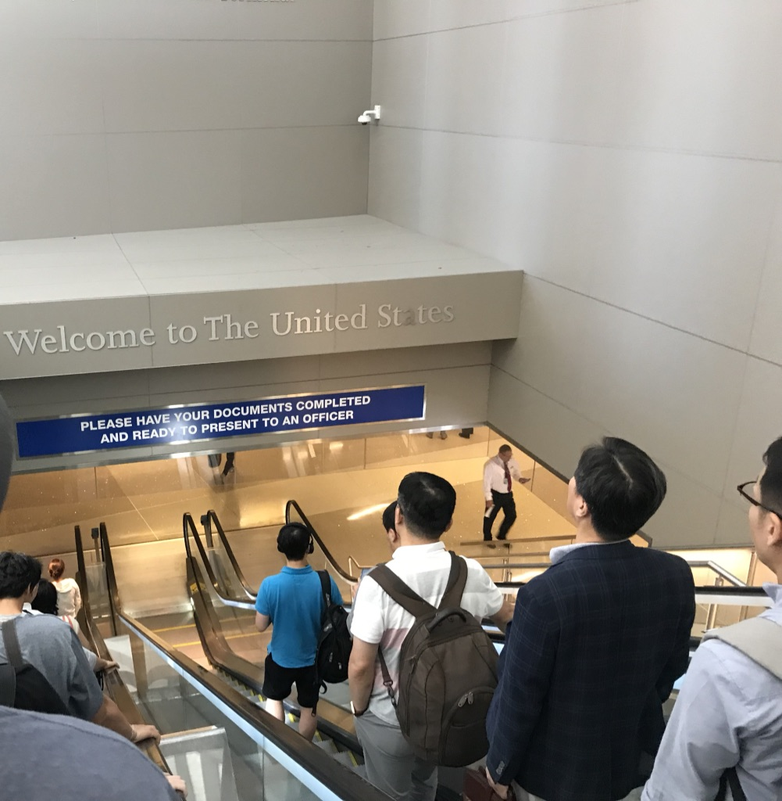

At the beginning of 2018, my thoughts of going abroad thrived after we were given opportunities to take part in exchange programs from all over the world. I believe I've always wanted to visit the U.S., whether because of its advancing technologies or its diversity in people. I was only able to choose the University of Utah so that I could finally end up in America. It turned out _to be not so bad_, after all. Besides, I really would like **a change of mind** and some air far away from the heavy school work of my home university. So I decided to go.

## First stop - Los Angeles

I had to transfer in Los Angeles before flying to Salt Lake City. First time I ever set my foot on U.S soil, I was so nervous and careful even when passing the security because all I thought of was _they may shoot me simply for doing something that seemed "suspicious"_. Yeah, _seriously_. Guess I was really terrified by the gunshot news. 🙃 People were all nice and patient, though. I didn't run into any trouble.

I got to take a first look at the city. It was dry and sunny. There was not much to see but only some tropical trees. I don't really like this kind of environment myself.

## 2002 Winter Olympics - Salt Lake City

I didn't know much about SLC except that it held 2002 Winter Olympics. I did do some research ahead of time but most of the impressions were about _strange_ Mormons. In general it was still a mystery before my arrival.

First impression: **clean and empty**! There are fewer cars and people. The city center is not big, making you hard to believe it's the state capital. You only get buses and trains (they are called Trax there) for public transportation. It's not so convenient as in China but Americans all have cars which makes public transportations less important in a wild west city.

University of Utah campus shares the same quality with the city. It's on the east side of the city and 30 minute ride far from it.

Large area of the campus was used for 2002 Olympics and also built as a result of it. I could see the buildings on campus were all pretty new and fresh. You cannot really sense their age unless you take a look at those bronze boards near the entrances with building dates branded on.

### Live

Exchange students are required to live on campus. This was really nice and I didn't have to go through much trouble as some of my classmates in New York. The cost for apartment rooms, however, was indeed expensive even for the locals. I shared an apartment with two other roommates. We had a living room, a kitchen, two bathrooms and each one's own room. It was quite a nice setting.

It would be much cheaper if people can make meals themselves in the United States. So a kitchen can be very useful. We got a fridge, a microwave and ovens... Everything! But my roommates seemed to only be able to cook instant noodles. 😂 Also, it was _way better_ to have one's own room both for study and entertainment. I didn't have to worry about being disturbed by night owls or early birds. 😋

One thing that was worth mentioning was the dryer. It is _**soooo nice**_ to have one at home. Clothes come out dry, fluffy and warm, saving you lots of time to hang them up. Speaking of this, we can use all the washing machines and dryers **for free**!

We also had RAs (Residence Assistant or Administrator?) to help out around and organize community events. Though I did not find many to be interested (or _at least myself_ :p), their ideas were generally simple and educating.

